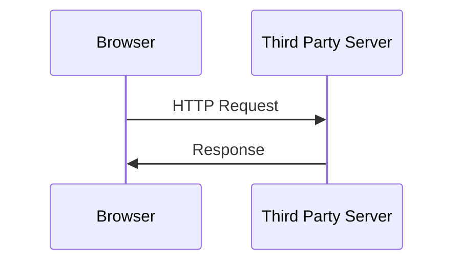
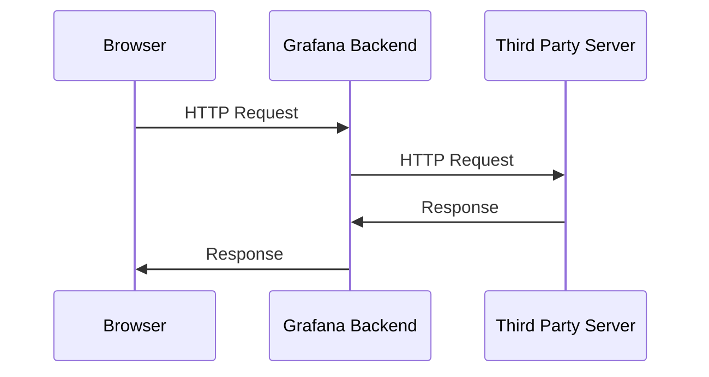

# Fetching data from frontend data source and app plugins

To fetch data from your data source an app plugins you have two options:

- Use the browser [Fetch API](https://developer.mozilla.org/en-US/docs/Web/API/Fetch_API) as you would do for any other javascript project
- Use the Grafana data proxy.

This page will guide you through how to use the data proxy to fetch data.

## Why use the data proxy?

If you have a data source or app plugin with frontend code and you need to fetch data, you might have encountered cross-site (CORS) limitations or the need to perform authenticated requests.

For these use cases, you want to make use of the data proxy API.

## How does it work?

Instead of performing a request directly from the browser to the server, you perform the request through the Grafana backend server, which will handle it and return the response to the plugin.

### Without data proxy



### With data proxy



Because the request to the third party server happens from the Grafana backend, there are no restrictions in CORS, and you can instruct Grafana to send the request authenticated.

# How to use the data proxy

Notice that you can only make use of the data proxy from data source and app plugins. **You can't use the data proxy from panel plugins.**

## Declare your route in your plugin.json

You first need to set up the routes in your `plugin.json`.

```json title="src/plugin.json"
"routes": [
	{
	  "path": "placeholder",
	  "url": "https://jsonplaceholder.typicode.com"
	}
],
```

You can see more advanced options to define your routes to include dynamic parameters.

> NOTE: You will have to build your plugin and restart the Grafana server every time you modify your plugin.json file.

## Fetch data from your frontend code

In your data source plugin, you can now fetch data by using the proxy URL. Here's a minimal example for your data source plugin using the jsonplaceholder free service:

```typescript
import {
  DataQueryRequest,
  DataQueryResponse,
  DataSourceApi,
  DataSourceInstanceSettings,
  FieldType,
  MutableDataFrame,
} from '@grafana/data';
import { getBackendSrv } from '@grafana/runtime';
import { lastValueFrom } from 'rxjs';

type TODO = {
  title: string;
  id: number;
};

export class DataSource extends DataSourceApi {
  baseUrl: string;
  constructor(instanceSettings: DataSourceInstanceSettings) {
    super(instanceSettings);
    // notice we are storing the url from the instanceSettings
    this.baseUrl = instanceSettings.url!;
  }

  async query(options: DataQueryRequest): Promise<DataQueryResponse> {
    const response = getBackendSrv().fetch<TODO[]>({
      // notice we are using the `placeholder` as defined
      // in the routes "path". Everything passed after will
      // be appended to the API url
      url: `${this.baseUrl}/placeholder/todos`,
    });
    // backendSrv fetch returns an observable object
    // we should unwrap with rxjs
    const responseData = await lastValueFrom(response);
    const todos = responseData.data;

    // we'll return the same todos for all queries in this example
    // in a real data source each target should fetch the data
    // as necessary.
    const data = options.targets.map((target) => {
      return new MutableDataFrame({
        refId: target.refId,
        fields: [
          { name: 'Id', type: FieldType.number, values: todos.map((todo) => todo.id) },
          { name: 'Title', type: FieldType.string, values: todos.map((todo) => todo.title) },
        ],
      });
    });

    return { data };
  }

  async testDatasource() {
    return {
      status: 'success',
      message: 'Success',
    };
  }
}
```

# Dynamic values and settings interpolation in routes

It is most likely that your plugin won't have a hard-coded API URL but will instead use the values the plugin's user will input. For these cases, you can use interpolation of variables in your routes.

Example:

```json title="src/plugin.json"
"routes": [
	{
	  "path": "interpolation",
	  "url": "{{ .JsonData.apiUrl }}"
	}
],
```

Now in the configuration page, we should ask the user to populate this `apiUrl`, and Grafana will use that value when calling this endpoint.

Here's an example of how your configuration form might look like

```typescript title="src/ConfigEditor.tsx"
export function ConfigEditor(props: Props) {
  const { onOptionsChange, options } = props;
  const { jsonData } = options;

  const onApiUrlChange = (event: ChangeEvent<HTMLInputElement>) => {
    onOptionsChange({
      ...options,
      jsonData: {
        ...jsonData,
        // notice we set the apiUrl value inside jsonData
        apiUrl: event.target.value,
      },
    });
  };

  return (
    <InlineField label="apiUrl" labelWidth={12}>
      <Input
        onChange={onApiUrlChange}
        value={jsonData.apiUrl || ''}
        placeholder="json field returned to frontend"
        width={40}
      />
    </InlineField>
  );
}
```

Once the field is set correctly, you may use it inside your data source. Following the previous example for the data source code, you can now simply use it as this:

```typescript
const response = getBackendSrv().fetch<TODO[]>({
  // Notice we use `interpolation` as defined
  // in the route path.
  // See the previous examples to see where
  // this.baseUrl comes from.
  url: `${this.baseUrl}/interpolation`,
});
```

## Using other HTTP Protocols e.g. POST, PUT, DELETE with the data proxy

You can specify the method directly in the `fetch` method. Your routes in `src/plugin.json` remain the same:

```typescript
const response = getBackendSrv().fetch<TODO[]>({
  url: `${this.baseUrl}`,
  method: 'POST',
  data: dataToSendViaPost,
});
```

## Adding authentication to your requests using the data proxy

You can read about adding authentication to the data proxy [here](./add-authentication-for-data-source-plugins.md)

## Debugging requests from the data proxy

If you wish to debug the requests that are going from the Grafana backend to your API, you can enable the data proxy logging in the [configuration](https://grafana.com/docs/grafana/latest/setup-grafana/configure-grafana/#dataproxy)

You must also [enable debug logs](https://grafana.com/docs/grafana/latest/setup-grafana/configure-grafana/#mode) in Grafana to be able to see the dataproxy logs

In your Grafana configuration file:

```
[log]
level = debug

[dataproxy]
logging = true
```

Now you will be able to see in the Grafana server output the requests going out to your API from the data proxy.

# FAQ

## I am using the [[DataSourceHttpSettings](https://developers.grafana.com/ui/latest/index.html?path=/story/data-source-datasourcehttpsettings--basic)](https://developers.grafana.com/ui/latest/index.html?path=/story/data-source-datasourcehttpsettings--basic) component. Where's the URL from the user?

The DataSourceHttpSettings sets the URL directly in the options that it is stored in `instanceSettings.url` instead of inside the jsonData. You can query that URL directly.

## Can I use the data proxy from an App plugin?

Yes. The setup of routes in your `plugin.json` remains the same, but since App plugins don't receive the URL as part of the props, you can construct the URL like this:

```typescript
const url = `api/plugin-proxy/${meta.id}/yourRoutePath`;
```

> NOTE: The plugin ID is not your plugin name (e.g., myorg-plugin-app) but the app ID. This can be found as part of the meta prop passed to the App plugin constructor. You can also get the plugin meta inside React with the hook `usePluginContext()`

## How can I use Authentication via the data proxy?

You can read about adding authentication to the data proxy [here](./add-authentication-for-data-source-plugins.md)

## Can I send special headers using the data proxy?

Yes. Here's an example of a route that sends additional headers

```json title="src/plugin.json"
"routes": [
{
	"path": "example",
	"url": "https://api.example.com",
	"headers": [
		{
		"name": "MyHeader",
		"content": "{{ .JsonData.headerValue }}"
		}
	]
}]
```
