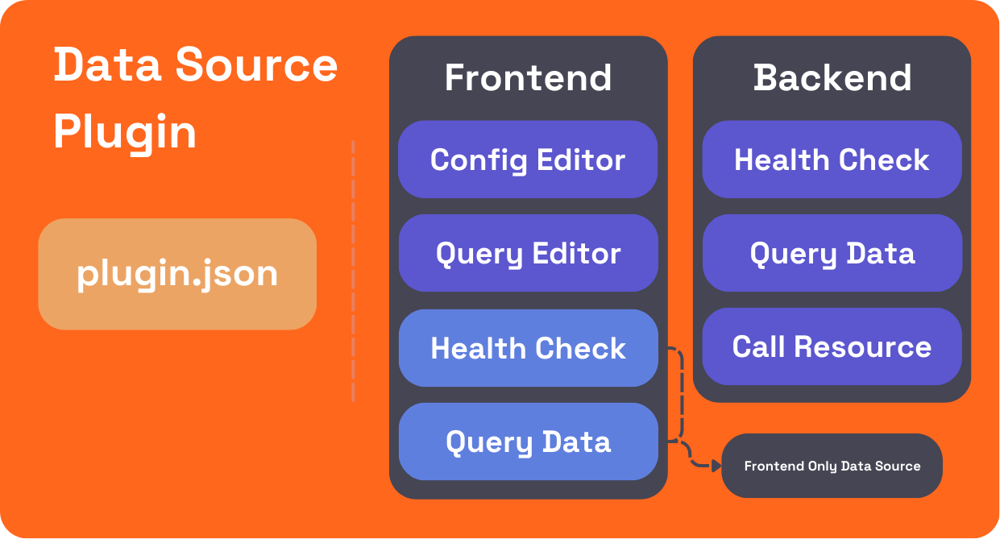

# Anatomy of a plugin

Grafana plugins enable you to extend Grafana’s core functionality by adding custom features, such as new data sources, visualizations, or entire applications. Each plugin type caters to specific needs, allowing developers to tailor solutions for a variety of use cases, from integrating external data services to creating bespoke UI elements.

This guide will walk you through the essential components of a Grafana plugin, the folder structure generated by the `create-plugin` tool, and how to organize your code for different plugin types. By the end, you will have a clear understanding of how to develop and structure a plugin, utilizing both frontend and backend components.

Before proceeding, we recommend reviewing the [plugin types and usage guide](/key-concepts/plugin-types-usage) to gain a basic understanding of the different types of plugins available.

## Plugin types

Each Grafana plugin is composed of several essential components that extend Grafana’s functionality in different ways. In this section, we’ll explore the core parts of a plugin, focusing on the three primary plugin types: Apps, Data Sources, and Panels.


## App plugins

App plugins provide maximum flexibility, allowing developers to build custom experiences that go beyond basic visualization or data interaction. They can include custom pages, backends for server-side logic, and UI extensions that hook into Grafana’s core functionality.


### Pages

Apps can add custom pages accessible from the Grafana navigation. These pages are essentially React components that allow developers to create custom user interfaces. To add a page, developers can use the `PluginPage` component from the `@grafana/runtime` package. You can [learn more about adding pages to apps](/tutorials/build-an-app-plugin#development-workflow) in our App guide.

### Configuration

App plugins often include configuration pages where users can input necessary settings like API credentials or other parameters. You can [learn more about adding configuration pages to apps](/tutorials/build-an-app-plugin#configuration-page) in our App guide.

### UI extensions

App plugins can register and expose UI extensions that hook into core Grafana features, providing additional functionality or interaction points. These extension points allow for powerful integrations with Grafana’s UI. You can [learn more about UI extensions](/how-to-guides/ui-extensions/) in our how-to guides.

### Health check

Apps can define health checks to ensure the plugin is properly configured and operational. These checks can be customized based on the plugin’s backend logic. See our [example health check](https://github.com/grafana/grafana-plugin-examples/blob/7d761244d370ad91715c68e24e6d83852d8e5b11/examples/app-with-backend/pkg/plugin/app.go#L47) for implementation details.

### Call resource

Apps can have backends to handle server-side functionality, such as making external API calls or processing more advanced authentication methods. The `CallResourceHandler` is commonly used for this purpose. See our [App with backend example](https://github.com/grafana/grafana-plugin-examples/tree/main/examples/app-with-backend) for implementation details.

### Nested plugins

App plugins can bundle multiple plugins, such as data sources or panels, into a single installable package. This approach is useful for services that require a combination of plugins for full functionality. You can [learn more about working with nested plugins](/how-to-guides/app-plugins/work-with-nested-plugins) in our documentation.

## Data source plugins

Data source plugins allow Grafana to connect to external services, configure queries, and display data. They can include frontend-only or full-stack components (with a backend).



### Config editor

The config editor is where users provide connection details (e.g., API keys, URLs) for the external service. To define the config editor, use `setConfigEditor()` and pass a custom configuration component. You can see [how to define a config editor in our datasource example](https://github.com/grafana/grafana-plugin-examples/blob/main/examples/datasource-basic/src/components/ConfigEditor/ConfigEditor.tsx).

Ensure sensitive data is stored securely using `secureJson`. Read our guide on [adding authentication for data source plugins](/how-to-guides/data-source-plugins/add-authentication-for-data-source-plugins#store-configuration-in-securejsondata) for more details.

### Query editor

The query editor allows users to construct queries against the connected service. This editor is used in the dashboard, Explore mode, and Alerting. Query editors can be customized to provide either a code editor or a guided query builder. You can see [how to define a query editor in our datasource example](https://github.com/grafana/grafana-plugin-examples/blob/main/examples/datasource-basic/src/components/QueryEditor/QueryEditor.tsx).

### Health check

The "Save and Test" button in the data source config page allows users to verify that the connection works. Plugins can customize this behavior by [adding custom health checks](/how-to-guides/data-source-plugins/convert-a-frontend-datasource-to-backend#health-check).

### Query data

The Query Data method processes multiple queries and returns corresponding responses. Each query includes a `RefID`, which is mapped to its response in a `QueryDataResponse`. The method loops through the queries, processes them individually, and returns either the result or an error with an appropriate status code.

This approach allows for efficient handling of multiple queries, with built-in logging and error management to ensure smooth operation.

Take a look at the [QueryData implementation in our Datasource example](https://github.com/grafana/grafana-plugin-examples/blob/main/examples/datasource-http-backend/pkg/plugin/datasource.go#L99).

### Call resource

Custom endpoints allow a data source plugin to expose custom HTTP API routes for server-side functionality. This is particularly useful when dealing with authentication, advanced queries, or processing large datasets. Custom endpoints can be created in the backend by using the `CallResourceHandler` method to handle requests and respond with data or status information.

For an example of implementing custom endpoints, see the [App with Backend example](https://github.com/grafana/grafana-plugin-examples/blob/main/examples/app-with-backend/pkg/plugin/resources.go).

## Panel plugins

Panel plugins extend Grafana by providing custom widgets to visualize data or provide other useful functionality within dashboards.


### Visualization

Panel plugins provide visual representations of data in Grafana dashboards. To create a custom visualization, developers use React components to define how data will be rendered on the dashboard. This visualization can be anything from a simple chart to a complex interactive widget. The panel’s `render()` function defines how the data is passed into the visualization and how updates are handled when data or options change.

For more details on panel visualizations, you can refer to the [panel plugin example](https://github.com/grafana/grafana-plugin-examples/tree/main/examples/panel-basic).

### Panel Options

Panel options allow users to customize the behavior and appearance of the panel plugin. Developers can define these options by implementing the `OptionsEditor` component, where they can expose options relevant to the visualization. These options are passed into the panel’s `render()` function, allowing for dynamic updates based on user inputs.

You can see an example of how to implement panel options in the [basic panel example](https://github.com/grafana/grafana-plugin-examples/blob/main/examples/panel-basic/src/types.ts#L5).

## Plugin folder structure

After running the `create-plugin` tool, a new folder for your plugin will be generated. The plugin folder follows a standard naming convention (e.g. `organization-pluginName-pluginType`) and contains all the necessary files for building, running, and testing your plugin. Here's an overview of the folder layout and key files:

```
myorg-myplugin-datasource/
├── .config/
├── .eslintrc
├── .github
│   └── workflows
├── .gitignore
├── .nvmrc
├── .prettierrc.js
├── CHANGELOG.md
├── LICENSE
├── Magefile.go
├── README.md
├── docker-compose.yaml
├── go.mod
├── go.sum
├── jest-setup.js
├── jest.config.js
├── node_modules
├── package.json
├── pkg
│   ├── main.go
│   └── plugin
├── playwright.config.ts
├── src
│   ├── README.md
│   ├── components
│   ├── datasource.ts
│   ├── img
│   ├── module.ts
│   ├── plugin.json
│   └── types.ts
├── tsconfig.json
└── tests
```

### Required files

You must include the following files in your project for the plugin to work properly:

| Filename            | Description                                                                                               |
| ------------------- | --------------------------------------------------------------------------------------------------------- |
| `./go.mod`          | Go modules dependencies. Refer to [Golang documentation](https://golang.org/cmd/go/#hdr-The_go_mod_file). |
| `./src/plugin.json` | A JSON file that contains the metadata describing the plugin.                                             |
| `./src/module.ts`   | The entry point for the plugin's frontend code.                                                           |
| `./pkg/main.go`     | The entry point for the backend code (only required if your plugin includes a backend).                   |

### Optional files

These files are not required but can enhance your plugin development experience:

| Filename        | Description                                                                      |
| --------------- | -------------------------------------------------------------------------------- |
| `./Magefile.go` | Strongly recommended for using build targets provided by the backend plugin SDK. |

### Key plugin files

The following files are crucial to your plugin, each serving a specific purpose in the development and functionality of the plugin:

- **Frontend code** (`src/`): This directory contains all the frontend code for your plugin. The main files to be aware of here are `plugin.json` and `module.ts`.
  - `plugin.json`: Stores [metadata about your plugin](/reference/plugin-json), including information like its description, supported Grafana versions, and dependencies.
  - `module.ts`: The entry point for your plugin's frontend logic.
- **Backend code** (`pkg/`): If your plugin includes backend functionality, the code will reside in this directory, typically within `pkg/plugin/`. Backend plugins are written in Go, and `main.go` serves as the entry point for your backend logic.
- **Test files** (`tests/`): This folder contains your plugin’s test files, typically suffixed with `.spec.ts` for frontend tests. You can [learn more about testing your plugin](/e2e-test-a-plugin/introduction) in our E2E testing guide.
- **Other files**:
  - `docker-compose.yaml`: Contains Docker configuration for running a local development instance of Grafana.
  - `CHANGELOG.md`: Documents the history of changes and updates made to the plugin.
  - `README.md`: Provides an overview of the plugin, including installation instructions and usage guidelines.

## Next Steps

Now that you have an understanding of the essential components of a Grafana plugin and the structure of the project, here are some recommended resources to help you continue developing and refining your plugin:

- **Tutorials**: Dive deeper into specific plugin development tasks with our [Grafana Plugin Tutorials](/tutorials). These guides will help you create and customize data sources, panels, and app plugins.
- **Plugin Examples**: Check out the [Grafana Plugin Examples repository](https://github.com/grafana/grafana-plugin-examples) on GitHub for sample projects showcasing various types of plugins.
- **Community**: Join the [Grafana Community](https://community.grafana.com/c/plugin-development/30) to get advice, share experiences, and seek help from other plugin developers.
- **Plugin Publishing**: When you’re ready to share your plugin, [learn how to publish a Grafana plugin](/publish-a-plugin/publish-a-plugin).

These resources will guide you through the finer details of building, testing, and eventually publishing your plugin, ensuring you have a smooth development process.
