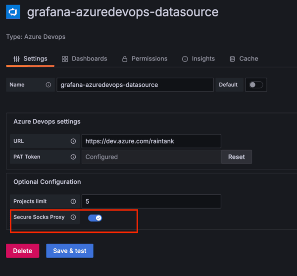

# Add support for Private Data Source Connect (PDC)

## What is Private Data Source Connect?

Private Data Source connect (PDC) is a way for you to establish a private, secured connection between a Grafana Cloud instance, or stack, and data sources secured within a private network.

Read more about [Private Data Source Connect](https://grafana.com/docs/grafana-cloud/connect-externally-hosted/private-data-source-connect/).

### When NOT to support PDC

PDC is a Grafana Cloud-only solution, so if your data source is not available in Grafana Cloud, there is not much benefit to implementing PDC support.

# Adding PDC to a data source

PDC support must be integrated in each data source because each Grafana plugin is responsible for establishing its own connection to the target data source. While Grafana stores the proxy configuration details (such as `proxy_address`, `server_address`, and certificates) in its config, each plugin consumes this configuration in a different way.

[`grafana-plugin-sdk-go`](https://github.com/grafana/grafana-plugin-sdk-go) provides an `httpClientProvider` that automatically uses the proxy configuration, making it easier for plugins that use the HTTP client from the plugin SDK to implement PDC support. However, plugins that use other types of clients require more manual adjustments to use the proxy configuration.

## Prerequisites

:::note

Note: It is not possible to add PDC support to frontend data sources because the connection to the proxy is established from the backend.
:::

- [`grafana-plugin-sdk`](https://github.com/grafana/grafana-plugin-sdk-go) version > [`0.229.0`](https://github.com/grafana/grafana-plugin-sdk-go/releases/tag/v0.229.0) is needed to get the latest changes compatible with the remote plugins. Keep this SDK up to date for the latest compatible changes.
- Grafana version > `10.0.0`

## Overview

Here’s the brief overview of the steps you need to take to add PDC to the data source plugin:

- Update the plugin frontend configuration section to include a toggle for enabling SOCKS proxying
- Update the plugin backend to use a SOCKS proxy transport when configured to do so
- Test and release the data source
- Enable PDC for the data source in Grafana Cloud
- Update public documentation

## Frontend Changes

On the frontend, we need to add a feature toggle to enable or disable PDC.

Add an attribute `enableSecureSocksProxy?: boolean;` to the configuration interface usually defined in `src/types.ts` like below:

```ts
export interface MyDataSourceOptions extends DataSourceJsonData {
  path?: string;
  // add this line
  enableSecureSocksProxy?: boolean;
}
```

Then add an option to `components/ConfigEditor.tsx` to be able to control this value with a toggle. It requires adding a few checks to make sure that:

- the feature toggle `secureSocksDSProxyEnabled` is set
- Grafana version is greater than 10.0.0

For example, here is how it’s done in Infinity data source:

```tsx
import { gte } from 'semver';

{
  config.featureToggles['secureSocksDSProxyEnabled' as keyof FeatureToggles] &&
    gte(config.buildInfo.version, '10.0.0') && (
      <>
        <InlineField
          label="Secure SOCKS Proxy"
          tooltip={
            <>
              Enable proxying the data source connection through the secure SOCKS proxy to a different network. See{' '}
              <a
                href="https://grafana.com/docs/grafana/next/setup-grafana/configure-grafana/proxy/"
                target="_blank"
                rel="noopener noreferrer"
              >
                Configure a data source connection proxy.
              </a>
            </>
          }
        >
          <div className={styles.toggle}>
            <Switch
              value={options.jsonData.enableSecureSocksProxy}
              onChange={(e) => {
                onOptionsChange({
                  ...options,
                  jsonData: {
                    ...options.jsonData,
                    enableSecureSocksProxy: e.currentTarget.checked,
                  },
                });
              }}
            />
          </div>
        </InlineField>
      </>
    );
}
```



## Backend changes

Depending on how the plugin connects to the data source, there are a few ways to add PDC support:

### HTTP Client: use the grafana-plugin-sdk HTTP client

This example involves plugins that use the [`http.Client`](https://github.com/grafana/grafana-plugin-sdk-go/blob/main/backend/httpclient/http_client.go#L21) from the grafana-plugin-sdk repository. Since this HTTP client already manages secure SOCKS proxying, you only need to configure its [transport](https://github.com/grafana/grafana-plugin-sdk-go/blob/main/backend/httpclient/http_client.go#L27) to apply the proxy settings. Consider the following code generated by [developers/plugin-tools](https://grafana.com/developers/plugin-tools/):

- `HTTPClientOptions(ctx)` reads and creates an HTTP client configuration based on the context passed from the Grafana process.
- `httpclient.New(opts)` calls `GetTransport()`. [Transport](https://github.com/grafana/grafana-plugin-sdk-go/blob/main/backend/httpclient/http_client.go#L90-L94) object is the one responsible for handling TLS, proxies, and other configurations within [the standard package](https://pkg.go.dev/net/http#hdr-Clients_and_Transports).
- `GetTransport() uses ConfigureSecureSocksHTTPProxy()` to wrap the `Transport` object into SOCKS5 proxy with TLS
- `ConfigureSecureSocksHTTPProxy()` calls `NewSecureSocksProxyContextDialer()` which creates a SOCKS proxy dialer.

This will proxy every request from the client through the proxy (and therefore through PDC), and then reach the data source.

```go
func NewDatasource(ctx context.Context, s backend.DataSourceInstanceSettings) (instancemgmt.Instance, error) {
    opts, err := s.HTTPClientOptions(ctx)
    if err != nil {
        return nil, err
    }
    httpClient, err := httpclient.New(opts)
    if err != nil {
        return nil, err
    }
    return &Datasource{HTTPClient: httpClient}, nil
}

```

Here are a few examples of how it was done for some data sources:

- [BigQuery](https://github.com/grafana/google-bigquery-datasource/pull/193/) \- an external library was used to connect to data source in those cases, but it allowed swapping the default HTTP client. So all we had to do to configure the PDC proxy was to pass a client from the SDK.
- [VictoriaMetrics Metrics Data Source](https://github.com/VictoriaMetrics/victoriametrics-datasource/releases/tag/v0.15.1)

### Non-HTTP client

We have a couple of options here, depending on what is available in the data source codebase:

#### Override the Dialer

Some packages expose a way to set the [Dialer](https://pkg.go.dev/golang.org/x/net/proxy#Dialer) for the client transport. Set the `dialer` in a client with the one returned by `NewSecureSocksProxyContextDialer`.

Overriding the dialer is less risky than overriding the whole Transport, as we’re changing fewer things.

For example, our PostgreSQL client allows replacing the default dialer with one that supports secure SOCKS proxying ([link to the code](https://github.com/grafana/grafana/blob/da24ad06bd90b6caeaa7ad553e0063f62b0b6c5c/pkg/tsdb/grafana-postgresql-datasource/postgres.go#L71-L80)):

```go
if proxyClient.SecureSocksProxyEnabled() {
    socksDialer, err := proxyClient.NewSecureSocksProxyContextDialer()
    if err != nil {
        logger.Error("postgres proxy creation failed", "error", err)
        return nil, nil, fmt.Errorf("postgres proxy creation failed")
    }

    d := newPostgresProxyDialer(socksDialer)

    // update the postgres dialer with the proxy dialer
    connector.Dialer(d)
}
```

Other example PRs:
[MySQL](https://github.com/grafana/grafana/blame/da24ad06bd90b6caeaa7ad553e0063f62b0b6c5c/pkg/tsdb/mysql/mysql.go#L92)

#### Override the Transport

Check if we can set the `Transport` object (usually an `http.RoundTripper`). Then it’s possible to use `httpclient.GetTransport(opts ...Options)` to obtain the `Transport` object and set it in the library or connector.

## Verifying that the changes are working

### Testing with Grafana Cloud instance

**Pre-requisites:** If you do not have a Grafana Cloud instance to test on yet, [sign up](https://grafana.com/docs/grafana-cloud/get-started/#sign-up-for-a-grafana-cloud-account) for a free Grafana Cloud account instance first.

Once you have added PDC support and before you wish to publish your plugin into our catalog, we require you to verify that it is working as intended in Grafana Cloud to make sure our and your customers have the best experience.

1. Build a ready to use version of your data source plugin that has PDC support
1. Reach out to us via `integrations+pdc@grafana.com` sending us your plugin version and which grafana cloud instance and organisation you want to have this plugin running on for testing.
1. We provision your instance with this plugin version and let you know that you can test
1. Once tested and confirmed you can go on with making this a regular release and submitting it for review

### Simulating / Testing locally with microsocks

In this case, we will use [microsocks](https://github.com/rofl0r/microsocks), which is an open source SOCKS server. This will not be the same as how Grafana runs in our cloud, but it shows a lightweight way to do this without any internal dependency.

Steps to run this method:

1. Install [microsocks](https://github.com/rofl0r/microsocks) . For macOS, this can be done with \`brew install microsocks\`
1. Run microsocks \-i 127.0.0.1 \-p 5555\. This will start up the SOCKS server and await for connections.
1. Run Grafana with this configuration.

   ```shell
   [feature_toggles]
   enable = secureSocksDSProxyEnabled

   [secure_socks_datasource_proxy]
   enabled = true
   proxy_address = localhost:5555
   allow_insecure = true
   ```

1. Create a new instance of the data source that you want to test. You should see the "Secure SOCKS Proxy" configuration section, with a toggle to Enable it.
1. Once enabled, click "Save & Test" and Grafana shows a message saying that the connection was successful.
1. In the microsocks logs you should see something similar to `client[5] 127.0.0.1: connected to <target>`, meaning that the connection was established via the server.
