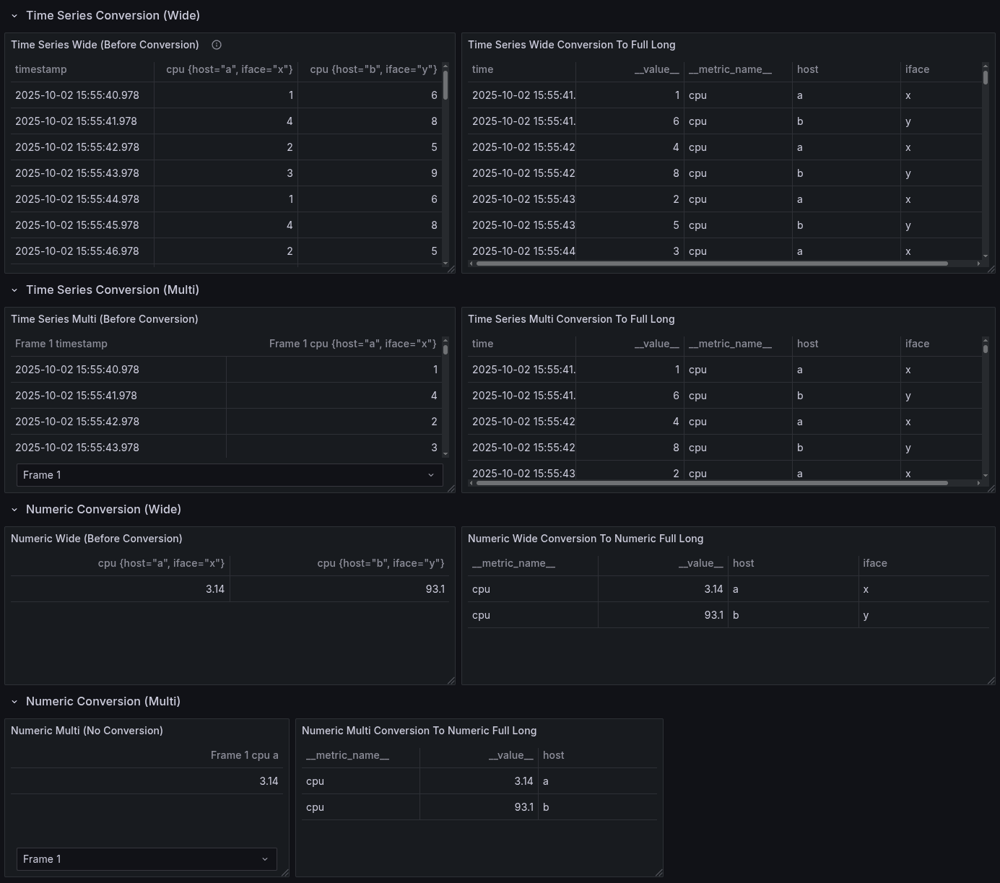

Follow this guide to understand what your data source plugin requires to support SQL expressions.

:::caution
Only plugins with a backend can support SQL expressions.
:::

Requirements depend on the type of response for your query. SQL expressions support two types of responses:

- [Tabular data response](#requirements-for-tabular-data-responses) 
- [Labeled metric time data response](#requirements-for-labeled-metric-data-responses) 

## Requirements for tabular data responses

A tabular data response is a single [data frame](../../key-concepts/data-frames) with no labels on any of the fields (columns). In short, a data frame that can be directly mapped to a SQL table.

Tabular data responses work out-of-the-box.

## Requirements for labeled metric data responses

A labeled metric time data response contains data that meets the [data plane specification](https://grafana.com/developers/dataplane) and has the `Frame.Meta.Type` property set with the data plane type. It can be a timeseries or numeric. 

SQL doesn't support labels, so when SQL expressions receive labeled metric data, it converts the data into the full-long format for the corresponding kind (timeseries or numeric). 

The supported types are:

- `timeseries-multi`
- `timeseries-wide`
- `numeric-multi`
- `numeric-wide`

For example, the following response (with `Frame.Meta.Type` serialized into JSON as `schema.meta.type`) supports SQL expressions:

```jsonc
[
  {
    "schema": {
      "meta": {
        "type": "numeric-wide", // SQL expressions need this property set for labeled metric data
        "typeVersion": [0, 1], // optional for SQL Expressions (so can be default 0.0)
        // TypeVersion > 0.0 should make other SSE operations more deterministic,
        // but if not a new DS, safest path is to do that as a separate task.
        // ...
      }
    },
    "fields": [
        // ...
    ]
  }
]
```

In Go:

```go
import (
    "github.com/grafana/grafana-plugin-sdk-go/data"
)

func main() {
    frame := data.NewFrame("")
    // ... add data and fields the create "NumericWide" type.
    frame.Meta = &data.FrameMeta{Type: data.FrameTypeNumericWide}
}
```

### What does conversion look like?

This is how SQL expressions convert labeled data:



## Test your plugin

### Test your plugin's SQL compatibility

In a dashboard, and for each type for response, follow these steps:

1. Add your data source query.
1. Add `Expression -> Type SQL`.
1. The default query is `SELECT * from A LIMIT 10` (assuming `RefID` is `A`). If this works on a few variations of that query type, it's compatible with SQL expressions.

### Check instrumentation for your data source to track SQL expression support

Use the following metrics to check your data source's compatibility with SQL expressions:

```
sum(rate(grafana_sse_sql_command_input_count[$__rate_interval])) by (status,attempted_conversion,datasource_type,input_frame_type)`
```

## Troubleshooting

### My data source sends labeled data without a frame type 

If your data source sends labeled data without a frame type and you select it in a SQL expression, you'll get an error like:

```
[sse.sql.input_conversion] failed to convert the results of query [A] (Datasource Type: [grafana-mock-datasource]) into a SQL/Tabular format for sql expression [B]: can not convert because the response is missing the data type (frame.meta.type) and has labels in the response that can not be mapped to a table
```

### My data source returns with multiple frames without a frame type

If your data source returns multiple frames without a frame type, you'll get an error like:

```
[sse.sql.input_conversion] failed to convert the results of query [A] (Datasource Type: [grafana-mock-datasource]) into a SQL/Tabular format for sql expression [B]: can not convert because the response is missing the data type (frame.meta.type) and has more than one data frame that can not be automatically mapped to a single table
```

### My data source returns multiple frames with different types

This is not supported for the moment. 

In this case, SQL expressions treat the first response as the type of all the frames. You'll likely get an odd error, or the results will be unreliable.

