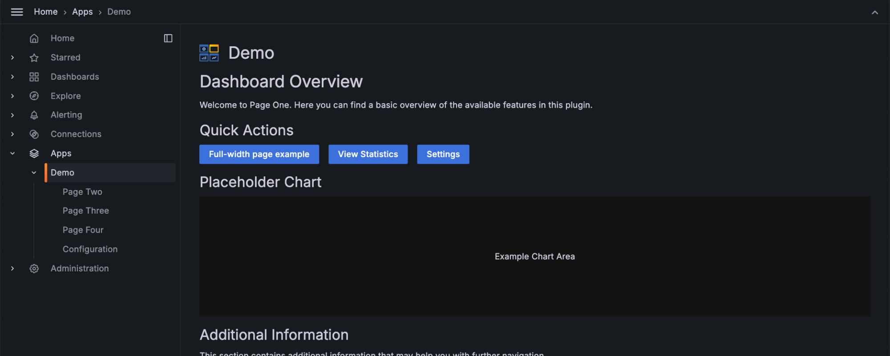
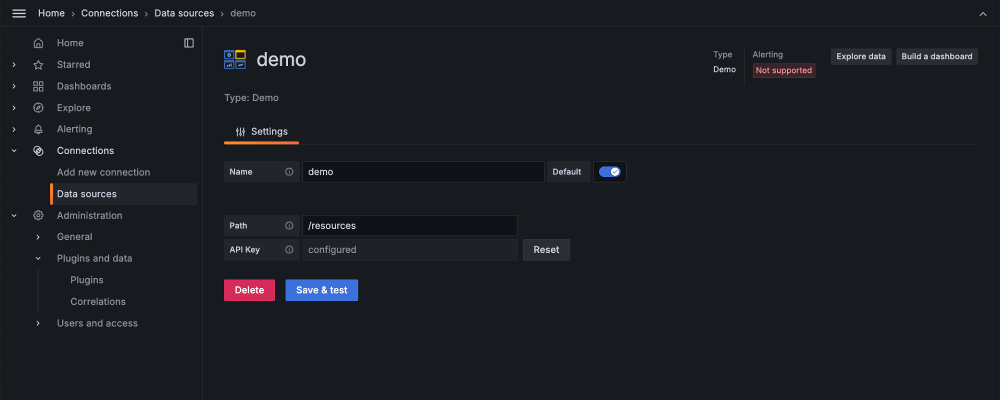
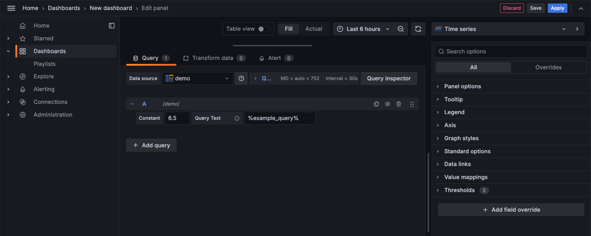
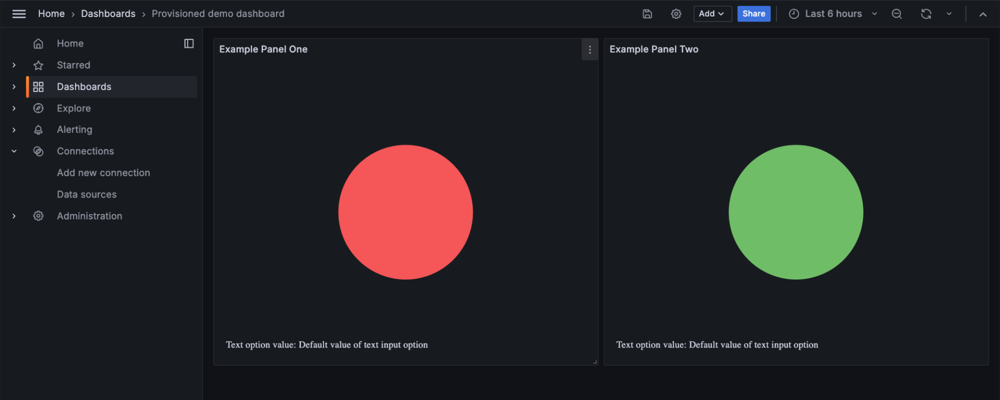
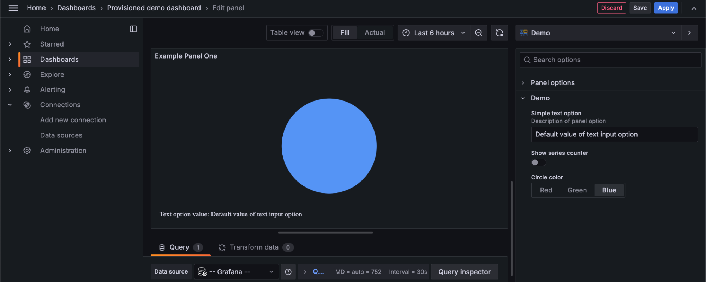

# Anatomy of a plugin

Grafana plugins enable you to extend Grafana’s core functionality by adding custom features, such as new data sources, visualizations, or entire applications.

This guide walks you through the essential components of a Grafana plugin, and how to structure and organize them. You'll learn about the folder structure generated by the `create-plugin` tool, and where to go next to learn how to build and extend a plugin using the scaffolded template.

**Watch the video below** to get a visual overview of the structure and components of a Grafana plugin. This video complements the written content in this guide and provides practical insights into the anatomy of a Grafana plugin.

<YouTubeEmbed videoId="dzFkEAVwjGI" title="Learn the Anatomy of a Grafana Plugin" />

## Before you begin

Before proceeding, review the [plugin types and usage guide](/key-concepts/plugin-types-usage) to gain a basic understanding of the different types of plugins available.

Each Grafana plugin is composed of several essential components that extend Grafana’s functionality in different ways. First, we’ll explore the core parts of each of the three primary plugin types: apps, data sources, and panels.


## App plugins

App plugins provide maximum flexibility, allowing developers to build custom experiences that go beyond basic visualization or data interaction. They can include custom pages, backends for server-side logic, and UI extensions that hook into Grafana’s core functionality.


### Pages

Apps can add custom pages accessible from the Grafana navigation. These pages are essentially React components that allow developers to create custom user interfaces. To add a page, developers can use the `PluginPage` component from the `@grafana/runtime` package. You can [learn more about adding pages to apps](/tutorials/build-an-app-plugin#add-a-page-in-the-navigation-menu) in our app tutorial.



### Configuration

App plugins often include configuration pages where users can input necessary settings like API credentials or other parameters. You can [learn more about adding configuration pages to apps](/tutorials/build-an-app-plugin#configuration-page) in our app tutorial.


### UI extensions

App plugins can register and expose UI extensions that hook into core Grafana features, providing additional functionality or interaction points. These extension points allow for powerful integrations with Grafana’s UI. You can [learn more about UI extensions](/how-to-guides/ui-extensions/) in our how-to guides.


### Health check

Apps can define health checks to ensure that the plugin is properly configured and operational. You can customize these checks based on the plugin’s backend logic. See our [documentation](/how-to-guides/data-source-plugins/convert-a-frontend-datasource-to-backend#health-check) for implementation details.

### Call resource

Apps can have backends to handle server-side functionality, such as making external API calls or processing more advanced authentication methods. The `CallResourceHandler` method is commonly used for this purpose. See our [documentation](/how-to-guides/app-plugins/add-backend-component#add-a-custom-endpoint-to-your-app-plugin) for implementation details.

### Nested plugins

App plugins can bundle multiple plugins, such as data sources or panels, into a single installable package. This approach is useful for services that require a combination of plugins for full functionality. You can [learn more about working with nested plugins](/how-to-guides/app-plugins/work-with-nested-plugins) in our documentation.

## Data source plugins

Data source plugins allow Grafana to connect to external services, configure queries, and display data. They can include frontend-only or full-stack components (with a backend).


### Config editor

The config editor is where users provide connection details (for example, API keys, URLs) for the external service when configuring a specific instance of the data source. To define the config editor, use `setConfigEditor()` and pass a custom configuration component. You can see [how to define a config editor in our data source tutorial](/tutorials/build-a-data-source-plugin#4-enable-configuration-for-your-data-source).

Ensure that your sensitive data is stored securely using `secureJson`. Read our guide on [adding authentication for data source plugins](/how-to-guides/data-source-plugins/add-authentication-for-data-source-plugins#store-configuration-in-securejsondata) for more details.



### Query editor

The query editor allows users to construct queries against the connected service. This editor is used when adding a panel in a dashboard, when using Explore, and when creating a new Alert Rule. Query editors can be customized to provide a [code editor](https://github.com/grafana/grafana/blob/main/packages/grafana-ui/src/components/Monaco/CodeEditor.tsx) as well as a guided query builder. You can see [how to define a query editor in our data source plugin tutorial](/tutorials/build-a-data-source-plugin#3-implement-your-query-editor).



### Health check

The "Save and Test" button in the data source config page allows users to verify that the connection works. Plugins can customize this behavior by [adding custom health checks](/how-to-guides/data-source-plugins/convert-a-frontend-datasource-to-backend#health-check).


### Query data

The `QueryData` method processes multiple queries and returns corresponding responses. Each query includes a `RefID`, which is mapped to its response in a `QueryDataResponse`. The method loops through the queries, processes them individually, and returns either the result or an error with an appropriate status code.

This approach allows for efficient handling of multiple queries, with built-in logging and error management to ensure smooth operation.

Take a look at the [Backend data source tutorial](/tutorials/build-a-data-source-backend-plugin#run-multiple-queries-concurrently).

### Call resource

Custom endpoints allow a data source plugin to expose custom HTTP API routes for server-side functionality. This is particularly useful when dealing with authentication, advanced queries, or processing large datasets. You can create custom endpoints in the backend by using the `CallResourceHandler` method to handle requests and respond with data or status information.

For an example of how to implement custom endpoints, refer to the [documentation](/how-to-guides/app-plugins/add-backend-component#add-a-custom-endpoint-to-your-app-plugin).

## Panel plugins

Panel plugins enhance Grafana by offering custom components that provide unique data visualizations or other useful widget-like functionality within dashboards.


### Visualization

Panel plugins provide visual representations of data in Grafana dashboards. To create a custom visualization, developers use React components to define how data will be rendered on the dashboard. This visualization can be anything from a simple chart to a complex interactive widget. The panel’s `render()` function defines how the data is passed into the visualization and how updates are handled when data or options change.

For more details on panel visualizations, refer to the [panel plugin tutorial](/tutorials/build-a-panel-plugin).



### Panel options

Panel options allow users to customize the behavior and appearance of the panel plugin. You can define these options by implementing the `OptionsEditor` component, which can expose options relevant to the visualization. These options are passed into the panel’s `render()` function, allowing for dynamic updates based on user inputs.

You can see an example of how to implement panel options in the [basic panel tutorial](/tutorials/build-a-panel-plugin).



## Plugin folder structure

Run the `create-plugin` tool to generate a new folder for your plugin. The plugin folder follows a standard naming convention (for example, `organization-pluginName-pluginType`) and contains all the necessary files for building, running, and testing your plugin.

Here's an overview of the folder layout and key files:

```
myorg-myplugin-datasource/
├── pkg/
│   ├── main.go
│   └── plugin/
├── src/
│   ├── module.ts
│   ├── plugin.json
└── tests/
├── CHANGELOG.md
├── docker-compose.yaml
├── go.mod
├── package.json
├── LICENSE
├── Magefile.go
├── README.md
```

:::note

The `create-plugin` CLI tool is constantly being improved and as such there may be minor differences between this documentation and your scaffolded plugin project.

:::

### Key plugin files

The following files are crucial for your plugin's development and functionality:

- **Frontend code** (`src/`): Required. This directory contains all the frontend code for your plugin. The main files to be aware of here are `plugin.json` and `module.ts`.
  - `plugin.json`: Stores [metadata about your plugin](/reference/plugin-json), including information like its description, supported Grafana versions, and dependencies.
  - `module.ts`: The entry point for your plugin's frontend logic.
- **Backend code** (`pkg/`): Required if your plugin has a backend component. If your plugin includes backend functionality, the code will reside in this directory, typically within `pkg/plugin/`. Plugin backend components are written in Go, and `main.go` serves as the entry point for your backend logic.
- **Test files** (`tests/`): Optional, but strongly recommended to ensure plugin quality. This folder contains your plugin’s test files, typically suffixed with `.spec.ts` for frontend tests. You can [learn more about testing your plugin](/e2e-test-a-plugin/index.md) in our E2E testing guide.
- **Other files**:
  - `docker-compose.yaml`: Required for Docker environment only. Contains the Docker configuration for running a local development instance of Grafana.
  - `CHANGELOG.md`: Required. Documents the history of changes and updates made to the plugin.
  - `README.md`: Required. Provides an overview of the plugin, including installation instructions and usage guidelines.

## Next steps

Now that you have an understanding of the essential components of a Grafana plugin and the structure of the project, we have some resources to recommend:

- **Tutorials**: Dive deeper into specific plugin development tasks with our [Grafana plugin tutorials](/tutorials). These guides will help you create and customize data sources, panels, and app plugins.
- **Plugin Examples**: Check out the [Grafana Plugin Examples repository](https://github.com/grafana/grafana-plugin-examples) on GitHub for sample projects showcasing various types of plugins.
- **Community**: Join the [Grafana Community](https://community.grafana.com/c/plugin-development/30) to get advice, share experiences, and seek help from other plugin developers.
- **Plugin Publishing**: When you’re ready to share your plugin, [learn how to publish a Grafana plugin](/publish-a-plugin/publish-a-plugin).

These resources will guide you through the finer details of building, testing, and eventually publishing your plugin, ensuring you have a smooth development process.
