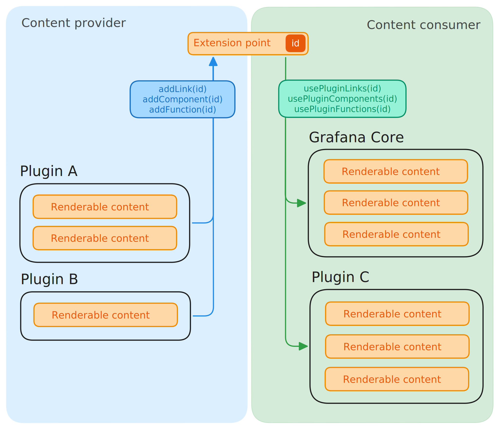
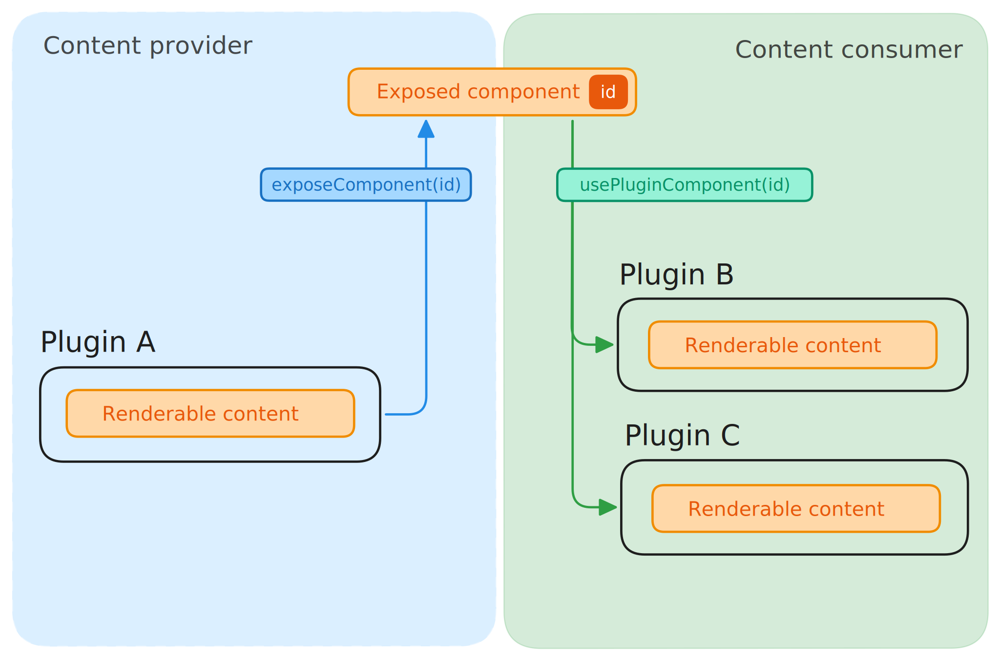

UI extensions are a powerful feature that allows your app plugin to integrate seamlessly with the Grafana UI and with other plugins. They provide a structured way to contribute content (like links and React components) to specific areas of the Grafana interface, or to share reusable components with other plugins.

This guide covers the fundamental concepts of the UI extensions ecosystem.

## The Core Idea: A Marketplace of UI Components

Imagine a marketplace where plugins can either offer UI components or pick up and use components offered by others.

- **Providers**: App plugins that offer content (links, components, or functions) are called **content providers**.
- **Consumers**: The parts of Grafana or other plugins that use this content are called **content consumers**.
- **Extension Points**: The specific locations in the UI where content can be placed are called **extension points**. Think of them as designated shelves in the marketplace.

As a plugin developer, you can act as both a provider and a consumer.

## Two Ways to Share: `add` vs. `expose`

There are two distinct methods for sharing content from your plugin:

1.  **`add` (Registering):** You decide exactly where your content appears.
2.  **`expose` (Exposing):** You offer a component for other plugins to use however they see fit.

Let's break down the differences.

### `add`: Contributing to Extension Points

Use the `add` method when you want to place your content in a specific, predefined location. This is like renting a specific spot in the marketplace to display your goods.

- **Your Role (Producer):** You create a link or a component and register it to a specific extension point, such as a panel menu or a navigation bar.
- **The Host's Role (Consumer):** The owner of the extension point (Grafana or another plugin) receives all the registered content and decides how to display it. The consumer doesn't know in advance who will contribute content.

**When to use `add`:**

- Adding a menu item to the Grafana panel menu.
- Adding a new tab to a page in Grafana.
- Contributing a button to a dashboard toolbar.

This approach is best when you want to tightly integrate your plugin's functionality into the existing Grafana UI.

### `expose`: Offering Reusable Components

Use the `expose` method when you want to provide a generic, reusable component that other plugins can incorporate into their own UI. This is like selling a building material (like bricks or windows) that others can use to construct their own things.

- **Your Role (Producer):** You expose a component, making it available by a unique ID. You don't know who will use it or where it will be displayed.
- **The User's Role (Consumer):** Another plugin developer can find your exposed component and choose to render it anywhere within their own plugin's interface.

**When to use `expose`:**

- Creating a unique data visualization that other datasource plugins could use.
- Building a custom form field or input control for other plugins to use in their configuration pages.
- Offering a complex UI widget, like an incident declaration modal, that can be triggered from anywhere.

This approach is ideal for creating a library of shared components and promoting reusability across the plugin ecosystem.

### Summary of Differences

| Feature          | `add` (Registering)                                       | `expose` (Exposing)                                         |
| :--------------- | :-------------------------------------------------------- | :---------------------------------------------------------- |
| **Analogy**      | Placing an item on a specific shelf                       | Selling a building material                                 |
| **Control**      | You (the producer) choose the location (extension point). | The consumer chooses the location.                          |
| **Awareness**    | The consumer discovers producers at runtime.              | The consumer knows which producer it's using.               |
| **Relationship** | One-to-many (one extension point, many contributors).     | One-to-one (one exposed component, one consumer at a time). |
| **Use Case**     | Integrating into specific UI locations.                   | Providing a library of reusable components.                 |

---

## How to Get Started

Now that you understand the core concepts, here's how you can start working with UI extensions:

### As a Content Provider (Sharing from your plugin)

If you want to share links or components from your app plugin, you have two paths:

- [**Register an Extension**](../how-to-guides/ui-extensions/register-an-extension.md): Learn how to `add` your content to a specific extension point.
- [**Expose a Component**](../how-to-guides/ui-extensions/expose-a-component.md): Learn how to `expose` a reusable component for other plugins to use.

### As a Content Consumer (Using extensions in your plugin)

If you want to use content from other plugins, you can:

- [**Create an Extension Point**](../how-to-guides/ui-extensions/create-an-extension-point.md): Allow other plugins to `add` content into your plugin's UI.
- [**Use an Exposed Component**](../how-to-guides/ui-extensions/use-an-exposed-component.md): Learn how to find and render an `exposed` component from another plugin.

## Further Reading

- [**Available Extension Points**](../reference/ui-extensions-reference/extension-points.md): See a list of all the extension points available in Grafana Core.
- [**Versioning Extensions**](../how-to-guides/ui-extensions/versioning-extensions.md): Best practices for versioning your exposed components and extension points.
- [**Debugging Extensions**](../how-to-guides/ui-extensions/debug-logs.md): Learn how to use logs to troubleshoot your extensions.
- [**API Reference**](../reference/ui-extensions-reference/ui-extensions.md): A detailed look at the UI extensions API.
